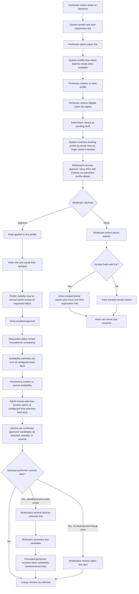

# Performer Workflow Flowchart

This file documents the current structure of `forms_bridge/performer_workflow.py` using Mermaid diagrams.

## End-To-End Flow

```mermaid
flowchart TD
    A[/POST performer-registration/start/] --> B[get_json_payload]
    B --> C[normalize_email]
    C --> D[connect to Postgres]
    D --> E[get_workflow_settings]
    E --> F[invalidate_unused_tokens registration_link for email]
    F --> G[generate_token_pair]
    G --> H[insert action_tokens registration_link]
    H --> I[send_registration_email via SMTP relay]
    I --> J[201 ok]

    K[/GET performer-registration/session?token/] --> L[get_action_token registration_link]
    L --> M[get_workflow_settings]
    M --> N[get_existing_profile_by_email]
    N --> O[get_latest_prefill_submission_by_email]
    O --> P[serialize prefill profile if draft exists]
    P --> Q[get_available_events]
    Q --> R[get_social_platforms]
    R --> S[return token-backed session JSON plus cooldown_events]

    T[/POST performer-registration/submit/] --> U[get_json_payload]
    U --> V[get_action_token registration_link]
    V --> W[get_workflow_settings]
    W --> X[normalize_profile_submission_payload]
    X --> Y[get_existing_profile_for_submission]
    Y --> Z[get_available_events]
    Z --> AA[ensure_requested_events_are_allowed]
    AA --> AB[ensure_social_platforms_exist]
    AB --> AC[supersede_pending_drafts]
    AC --> AD[insert_profile_submission_draft]
    AD --> AE[insert_profile_submission_social_links]
    AE --> AF[insert_requested_dates]
    AF --> AG[get_profile_submission_draft]
    AG --> AH[get_upcoming_event_status_summary]
    AH --> AI[get_moderator_emails]
    AI --> AJ[create_moderation_links]
    AJ --> AK[mark_action_token_used registration token]
    AK --> AL[send_moderation_emails]
    AL --> AM[201 ok]

    AN[/GET moderation/approve?token/] --> AO[get_action_token moderation_approve]
    AO --> AP[get_profile_submission_draft]
    AP --> AQ{draft pending?}
    AQ -- no --> AR[error page]
    AQ -- yes --> AS[apply_approved_draft]
    AS --> AT[attach_profile_to_draft]
    AT --> AU[record_moderation_action approved]
    AU --> AV[finalize_draft_status approved]
    AV --> AW[invalidate_moderation_tokens_for_draft]
    AW --> AX[get_workflow_settings]
    AX --> AY[send_profile_approved_email]
    AY --> AZ[success page]

    BA[/GET moderation/deny?token/] --> BB[get_action_token moderation_deny]
    BB --> BC[get_profile_submission_draft]
    BC --> BD{draft pending?}
    BD -- no --> BE[error page]
    BD -- yes --> BF[render_denial_form]

    BG[/POST moderation/deny/] --> BH[get_action_token moderation_deny]
    BH --> BI[get_profile_submission_draft]
    BI --> BJ{draft pending?}
    BJ -- no --> BK[error page]
    BJ -- yes --> BL[record_moderation_action denied]
    BL --> BM[finalize_draft_status denied]
    BM --> BN[invalidate_moderation_tokens_for_draft]
    BN --> BO{include_edit_link?}
    BO -- yes --> BP[create_registration_link]
    BO -- no --> BQ[skip]
    BP --> BR[send_profile_denied_email]
    BQ --> BR
    BR --> BS[success page]

    BT[availability reminder job] --> BU[get_workflow_settings]
    BU --> BV[get_due_availability_requests]
    BV --> BW[invalidate old availability tokens per requested_date]
    BW --> BX[create confirm/cancel action tokens]
    BX --> BY[send_availability_email]
    BY --> BZ[set requested_dates.availability_email_sent_at]
    BZ --> CA[get_unapproved_event_reminders]
    CA --> CB[send_unapproved_request_reminder_email]
    CB --> CC[set requested_dates.moderator_reminder_sent_at]

    CD[/GET availability/confirm?token/] --> CE[get_action_token availability_confirm]
    CE --> CF[get_requested_date_with_context]
    CF --> CG[ensure_requested_date_is_actionable]
    CG --> CH[update_requested_date_availability_status confirmed]
    CH --> CI[invalidate_availability_tokens_for_requested_date]
    CI --> CJ[success page]

    CK[/GET availability/cancel?token/] --> CL[get_action_token availability_cancel]
    CL --> CM[get_requested_date_with_context]
    CM --> CN[ensure_requested_date_is_actionable]
    CN --> CO[update_requested_date_availability_status cancelled]
    CO --> CP[invalidate_availability_tokens_for_requested_date]
    CP --> CQ[handle_selection_cancellation_if_needed]
    CQ --> CR{selected performer cancelled?}
    CR -- no --> CS[success page]
    CR -- yes, standby/reserve candidates exist --> CT[invalidate old backup_selection tokens]
    CT --> CU[create backup_selection tokens]
    CU --> CV[send_backup_selection_email]
    CV --> CW[success page]
    CR -- yes, no standby/reserve and lineup short --> CX[send_open_slot_alert_email]
    CX --> CY[success page]

    CZ[admin selection reminder job] --> DA[get_workflow_settings]
    DA --> DB[get_due_admin_selection_events]
    DB --> DC[get_admin_emails]
    DC --> DD[create admin_selection tokens]
    DD --> DE[send_admin_selection_email]
    DE --> DF[set events.admin_selection_email_sent_at]

    DG[/GET admin-selection/events/] --> DH[get_upcoming_open_mic_events]
    DH --> DI[JSON events list]

    DJ[/POST admin-selection/start/] --> DK[get_json_payload]
    DK --> DL[normalize_email]
    DL --> DM[get_workflow_settings]
    DM --> DO[get_admin_profile_by_email]
    DO --> DP{admin found?}
    DP -- no --> DQ[return generic ok message]
    DP -- yes --> DS[invalidate_unused_tokens admin_selection for email]
    DS --> DT[create admin_selection token]
    DT --> DU[send_admin_selection_access_email]
    DU --> DV[return generic ok message]

    DW[/GET admin-selection?token/] --> DX[get_action_token admin_selection]
    DX --> DY[resolve_admin_selection_event_context from event_id query param or default]
    DY --> DZ{acquire_admin_selection_lock}
    DZ -- no --> EA[409 lock error page]
    DZ -- yes --> EB[get_event_selection_context]
    EB --> EC[get_admin_selection_candidates]
    EC --> ED[get_workflow_settings]
    ED --> EE[render_admin_selection_form]

    EF[/POST admin-selection?token/] --> EG[get_action_token admin_selection]
    EG --> EH[resolve_admin_selection_event_context from form event_id]
    EH --> EI{acquire_admin_selection_lock}
    EI -- no --> EJ[409 lock error page]
    EI -- yes --> EK[get_workflow_settings]
    EK --> EL[get_event_selection_context]
    EL --> EM[get_admin_selection_candidates]
    EM --> EN[parse_admin_selection_statuses]
    EN --> EO[save_admin_selection]
    EO --> EP[mark_action_token_used]
    EP --> EQ[release_admin_selection_lock]
    EQ --> ER[send_selected_performer_emails]
    ER --> ES[success page]

    ET[/GET admin-selection/send-confirmation/] --> EU[get_action_token admin_selection]
    EU --> EV[resolve_admin_selection_event_context from event_id query param]
    EV --> EW{acquire_admin_selection_lock}
    EW -- no --> EX[409 lock error page]
    EW -- yes --> EY[get_event_selection_context]
    EY --> EZ[send_availability_confirmation_for_requested_date]
    EZ --> FA[get_admin_selection_candidates]
    FA --> FB[get_workflow_settings]
    FB --> FC[render_admin_selection_form with notice]

    FD[/POST admin-selection/lock/] --> FE[get_action_token admin_selection]
    FE --> FF[resolve_admin_selection_event_context from event_id]
    FF --> FG{acquire_admin_selection_lock}
    FG -- no --> FH[409 JSON error]
    FG -- yes --> FI[JSON lock heartbeat ok]

    FJ[/POST admin-selection/lock/release/] --> FK[get_action_token admin_selection]
    FK --> FL[resolve_admin_selection_event_context from event_id]
    FL --> FM[release_admin_selection_lock]
    FM --> FN2[204]

    FN[/GET backup-selection?token/] --> FO[get_action_token backup_selection]
    FO --> FP[get_event_selection_context]
    FP --> FQ[get_current_selected_lineup]
    FQ --> FR[get_backup_candidates]
    FR --> FS{backups exist?}
    FS -- no --> FT[error page]
    FS -- yes --> FU[render_backup_selection_form]

    FV[/POST backup-selection/] --> FW[get_action_token backup_selection]
    FW --> FX[get_event_selection_context]
    FX --> FY[get_workflow_settings]
    FY --> FZ[promote_backup_selection]
    FZ --> GA[invalidate_backup_selection_tokens_for_event]
    GA --> GB[create_availability_action_links for promoted performer]
    GB --> GC[send_backup_promoted_email with confirm/cancel links]
    GC --> GD[success page]

    GE[expired moderation token reminder job] --> GF[get_expired_moderation_token_reminder_targets]
    GF --> GG[create_moderation_links]
    GG --> GH[mark_expired_moderation_tokens_replaced]
    GH --> GI[send_moderation_emails]
```

## Business Process Diagram

## Route / Helper / Data Interaction Map

```mermaid
flowchart LR
    subgraph Routes
        R1[start_performer_registration]
        R2[get_performer_registration_session]
        R3[submit_performer_registration]
        R4[approve_profile_submission]
        R5[deny_profile_submission]
        R6[confirm_requested_date]
        R7[cancel_requested_date]
        R8[admin_selection]
        R9[admin_selection_send_confirmation]
        R10[admin_selection_lock_heartbeat]
        R11[admin_selection_lock_release]
        R12[admin_selection_events]
        R13[admin_selection_start]
        R14[backup_selection]
    end

    subgraph ValidationAndTokenHelpers
        H1[get_json_payload]
        H2[normalize_email]
        H3[normalize_profile_submission_payload]
        H4[get_action_token]
        H5[generate_token_pair]
        H6[invalidate_unused_tokens]
        H7[invalidate_moderation_tokens_for_draft]
        H8[mark_action_token_used]
        H9[invalidate_availability_tokens_for_requested_date]
        H10[invalidate_backup_selection_tokens_for_event]
        H11[create_registration_link]
    end

    subgraph ReadHelpers
        Q1[get_workflow_settings]
        Q2[get_existing_profile_by_email]
        Q3[get_existing_profile_by_display_name]
        Q4[get_existing_profile_by_id]
        Q5[get_existing_profile_for_submission]
        Q6[get_latest_prefill_submission_by_email]
        Q7[get_social_platforms]
        Q8[get_available_events]
        Q9[get_moderator_emails]
        Q10[get_profile_submission_draft]
        Q11[get_requested_date_with_context]
        Q12[get_due_availability_requests]
        Q13[get_unapproved_event_reminders]
        Q14[get_due_admin_selection_events]
        Q15[get_admin_emails]
        Q16[get_event_selection_context]
        Q17[get_admin_selection_candidates]
        Q18[get_current_selected_lineup]
        Q19[get_backup_candidates]
        Q20[get_open_mic_event_for_admin_selection]
        Q21[get_admin_profile_by_email]
        Q22[get_upcoming_open_mic_events]
    end

    subgraph WriteHelpers
        W1[supersede_pending_drafts]
        W2[insert_profile_submission_draft]
        W3[insert_profile_submission_social_links]
        W4[insert_requested_dates]
        W5[create_moderation_links]
        W6[apply_approved_draft]
        W7[upsert_artist_role]
        W8[replace_profile_social_links]
        W9[update_profile_visibility_from_requests]
        W10[record_moderation_action]
        W11[finalize_draft_status]
        W12[attach_profile_to_draft]
        W13[update_requested_date_availability_status]
        W14[handle_selection_cancellation_if_needed]
        W15[save_admin_selection]
        W16[promote_backup_selection]
        W17[create_availability_action_links]
        W18[acquire_admin_selection_lock]
        W19[release_admin_selection_lock]
        W20[send_availability_confirmation_for_requested_date]
    end

    subgraph MailHelpers
        M1[send_registration_email]
        M2[send_moderation_emails]
        M3[send_profile_approved_email]
        M4[send_profile_denied_email]
        M5[send_mail]
        M6[send_availability_email]
        M7[send_unapproved_request_reminder_email]
        M8[send_admin_selection_email]
        M9[send_selected_performer_emails]
        M10[send_backup_selection_email]
        M11[send_backup_promoted_email]
        M12[send_open_slot_alert_email]
    end

    subgraph Tables
        T1[(app_settings)]
        T2[(action_tokens)]
        T3[(profiles)]
        T4[(profile_roles)]
        T5[(profile_social_profiles)]
        T6[(profile_submission_drafts)]
        T7[(profile_submission_social_profiles)]
        T8[(requested_dates)]
        T9[(moderation_actions)]
        T10[(events)]
        T11[(performances)]
        T12[(social_platforms)]
        T13[(event_performer_selections)]
        T14[(admin_selection_locks)]
    end

    R1 --> H1 --> H2 --> Q1
    R1 --> H6 --> H5 --> T2
    R1 --> M1 --> M5

    R2 --> H4 --> T2
    R2 --> Q1 --> T1
    R2 --> Q2 --> T3
    Q2 --> T4
    Q2 --> T5
    R2 --> Q6 --> T6
    R2 --> Q8 --> T10
    Q8 --> T11
    R2 --> Q7 --> T12

    R3 --> H1
    R3 --> H4 --> T2
    R3 --> Q1 --> T1
    R3 --> H3
    R3 --> Q5
    Q5 --> Q2
    Q5 --> Q3
    Q3 --> Q4
    R3 --> Q8
    R3 --> W1 --> T6
    R3 --> W2 --> T6
    R3 --> W3 --> T7
    R3 --> W4 --> T8
    R3 --> Q10 --> T6
    R3 --> Q9 --> T3
    Q9 --> T4
    R3 --> W5 --> T2
    R3 --> H8 --> T2
    R3 --> M2 --> M5

    R4 --> H4 --> T2
    R4 --> Q10 --> T6
    Q10 --> T7
    Q10 --> T8
    R4 --> W6 --> T3
    W6 --> W7 --> T4
    W6 --> W8 --> T5
    W6 --> W9 --> T3
    W9 --> T10
    R4 --> W10 --> T9
    R4 --> W11 --> T6
    R4 --> W12 --> T6
    R4 --> H7 --> T2
    R4 --> M3 --> M5

    R5 --> H4 --> T2
    R5 --> Q10 --> T6
    R5 --> W10 --> T9
    R5 --> W11 --> T6
    R5 --> H7 --> T2
    R5 --> H11 --> T2
    R5 --> M4 --> M5

    R6 --> H4 --> T2
    R6 --> Q11 --> T8
    Q11 --> T6
    Q11 --> T10
    R6 --> W13 --> T8
    R6 --> H9 --> T2

    R7 --> H4 --> T2
    R7 --> Q11 --> T8
    R7 --> W13 --> T8
    R7 --> H9 --> T2
    R7 --> W14
    W14 --> Q9
    W14 --> Q16
    W14 --> Q19
    W14 --> M10
    W14 --> M12

    R8 --> H4 --> T2
    R8 --> W18 --> T14
    R8 --> Q16 --> T10
    R8 --> Q17 --> T8
    Q17 --> T6
    Q17 --> T3
    Q17 --> T13
    R8 --> W15 --> T13
    W15 --> T8
    R8 --> H8 --> T2
    R8 --> W19 --> T14
    R8 --> M9 --> M5

    R9 --> H4 --> T2
    R9 --> W18 --> T14
    R9 --> Q16 --> T10
    R9 --> W20 --> T8
    W20 --> W17 --> T2
    R9 --> Q17 --> T13
    R9 --> M6 --> M5

    R10 --> H4 --> T2
    R10 --> W18 --> T14

    R11 --> H4 --> T2
    R11 --> W19 --> T14

    R12 --> Q22 --> T10

    R13 --> H1 --> H2
    R13 --> Q1 --> T1
    R13 --> Q20 --> T10
    R13 --> Q21 --> T3
    Q21 --> T4
    R13 --> W19 --> T14
    R13 --> H6 --> T2
    R13 --> H5 --> T2
    R13 --> M8 --> M5

    R14 --> H4 --> T2
    R14 --> Q16 --> T10
    R14 --> Q18 --> T13
    Q18 --> T3
    R14 --> Q19 --> T13
    R14 --> W16 --> T13
    W16 --> T8
    R14 --> H10 --> T2
    R14 --> W17 --> T2
    R14 --> M11 --> M5

    Q12 --> T8
    Q12 --> T6
    Q12 --> T10
    Q13 --> T8
    Q13 --> T6
    Q13 --> T3
    Q14 --> T10
    Q15 --> T3
    Q15 --> T4
```

## Sequence Diagram

```mermaid
sequenceDiagram
    autonumber
    participant Performer as Performer Browser
    participant Site as /perform/ page JS
    participant AdminPage as /perform/admin page JS
    participant Bridge as forms_bridge
    participant DB as Postgres
    participant SMTP as SMTP Relay
    participant Mod as Moderator
    participant Admin as Admin

    Performer->>Site: Open /perform/
    Site-->>Performer: Show email-only start form

    Performer->>Site: Submit email
    Site->>Bridge: POST /api/forms/performer-registration/start
    Bridge->>DB: Read app_settings
    Bridge->>DB: Invalidate old registration tokens for email
    Bridge->>DB: Insert new registration token
    Bridge->>SMTP: Send one-time registration email
    SMTP-->>Performer: Registration link email
    Bridge-->>Site: ok

    Performer->>Site: Open emailed token link
    Site->>Bridge: GET /api/forms/performer-registration/session?token=...
    Bridge->>DB: Validate token
    Bridge->>DB: Load live profile by email
    Bridge->>DB: Load latest prefill draft for email
    Bridge->>DB: Compute eligible Open Mic dates
    Bridge->>DB: Load social platform options
    Bridge-->>Site: Session JSON and cooldown_events
    Site-->>Performer: Prefilled profile and event selection form

    Performer->>Site: Submit profile, social links, requested dates
    Site->>Bridge: POST /api/forms/performer-registration/submit
    Bridge->>DB: Validate token
    Bridge->>DB: Match existing profile by email
    alt No email match
        Bridge->>DB: Match existing profile by stage name
    end
    Bridge->>DB: Validate allowed dates and social platforms
    Bridge->>DB: Supersede older pending drafts
    Bridge->>DB: Insert draft and social links and requested dates
    Bridge->>DB: Build next-event status summary
    Bridge->>DB: Insert approve/deny moderation tokens per moderator
    Bridge->>DB: Mark registration token used
    Bridge->>SMTP: Send moderation emails (existing profile snapshot and submitted draft)
    SMTP-->>Mod: Approve / deny links
    Bridge-->>Site: ok

    alt Moderator approves
        Mod->>Bridge: GET /api/forms/performer-registration/moderation/approve?token=...
        Bridge->>DB: Validate approve token
        Bridge->>DB: Load draft
        Bridge->>DB: Apply draft to live profile (insert/update)
        Bridge->>DB: Attach profile_id to draft if newly created
        Bridge->>DB: Record moderation action and finalize draft approved
        Bridge->>DB: Invalidate both moderation links
        Bridge->>SMTP: Send approval email
        SMTP-->>Performer: Approval email
        Bridge-->>Mod: Success page
    else Moderator denies
        Mod->>Bridge: GET /api/forms/performer-registration/moderation/deny?token=...
        Bridge->>DB: Validate deny token and pending state
        Bridge-->>Mod: Denial form
        Mod->>Bridge: POST deny reason (optional include_edit_link)
        Bridge->>DB: Validate deny token and pending state
        Bridge->>DB: Record moderation action and finalize draft denied
        Bridge->>DB: Invalidate both moderation links
        alt include_edit_link checked
            Bridge->>DB: Invalidate old registration links and create fresh registration link
        end
        Bridge->>SMTP: Send denial email (with optional edit link)
        SMTP-->>Performer: Denial email
        Bridge-->>Mod: Success page
    end

    Bridge->>DB: Availability reminder job finds due requests
    Bridge->>DB: Create confirm/cancel availability tokens
    Bridge->>SMTP: Send availability emails
    Bridge->>DB: Mark availability_email_sent_at
    Bridge->>DB: For unapproved requesters, send moderator reminder emails
    Bridge->>DB: Mark moderator_reminder_sent_at

    alt Performer confirms
        Performer->>Bridge: GET /api/forms/performer-registration/availability/confirm?token=...
        Bridge->>DB: Validate confirm token and requested_date status
        Bridge->>DB: Set status availability_confirmed
        Bridge->>DB: Invalidate both availability links
        Bridge-->>Performer: Success page
    else Performer cancels
        Performer->>Bridge: GET /api/forms/performer-registration/availability/cancel?token=...
        Bridge->>DB: Validate cancel token and requested_date status
        Bridge->>DB: Set status availability_cancelled
        Bridge->>DB: Invalidate both availability links
        Bridge->>DB: Update selection state if candidate was selected/standby
        alt Backups exist
            Bridge->>DB: Invalidate old backup tokens and create fresh backup-selection tokens
            Bridge->>SMTP: Email moderators backup-selection link
        else No backups and lineup now short
            Bridge->>SMTP: Email moderators open-slot alert
        end
        Bridge-->>Performer: Success page
    end

    Admin->>AdminPage: Open /perform/admin/
    Admin->>AdminPage: Request admin link
    AdminPage->>Bridge: POST /api/forms/performer-registration/admin-selection/start
    Bridge->>DB: Validate admin profile by email
    alt Admin profile found
        Bridge->>DB: Invalidate unused admin tokens for admin email
        Bridge->>DB: Insert fresh admin token
        Bridge->>SMTP: Send admin selection access email
    end
    Bridge-->>AdminPage: Generic success message

    Bridge->>DB: Admin-selection reminder job sends event links at final_selection_lead_days

    Admin->>Bridge: GET /api/forms/performer-registration/admin-selection?token=...
    Admin->>Bridge: GET /api/forms/performer-registration/admin-selection?token=...&event_id=...
    Bridge->>DB: Validate token
    Bridge->>DB: Resolve selected event from event_id or default
    Bridge->>DB: Acquire event edit lock
    Bridge->>DB: Load event and candidates and max_performers
    Bridge-->>Admin: Tokenized selection page where only confirmed and approved candidates are selectable

    loop every ~60s while page open
        Admin->>Bridge: POST /api/forms/performer-registration/admin-selection/lock?token=...&event_id=...
        Bridge->>DB: Refresh lock heartbeat
        Bridge-->>Admin: ok or 409 if lock lost
    end

    Admin->>Bridge: POST /api/forms/performer-registration/admin-selection?token=...&event_id=...
    Bridge->>DB: Validate token and lock
    Bridge->>DB: Parse selected/standby/reserve statuses
    Bridge->>DB: Save event_performer_selections
    Bridge->>DB: Mark selected requested_dates selected_at/by
    Bridge->>DB: Apply cooldown reserve rows for future events
    Bridge->>DB: Mark admin token used
    Bridge->>DB: Release lock
    Bridge->>SMTP: Email selected performers
    Bridge-->>Admin: Success page

    alt Admin re-sends confirmation from selection page
        Admin->>Bridge: GET /api/forms/performer-registration/admin-selection/send-confirmation?token=...&event_id=...&requested_date_id=...
        Bridge->>DB: Validate token and lock
        Bridge->>DB: Recreate availability tokens for requested performer
        Bridge->>SMTP: Send availability email
        Bridge-->>Admin: Selection page with success notice
    end

    alt Moderator promotes standby/reserve later
        Mod->>Bridge: GET /api/forms/performer-registration/backup-selection?token=...
        Bridge->>DB: Validate token and load lineup and backup candidates
        Bridge-->>Mod: Backup selection page
        Mod->>Bridge: POST /api/forms/performer-registration/backup-selection
        Bridge->>DB: Promote chosen candidate to selected
        Bridge->>DB: Invalidate backup-selection tokens for event
        Bridge->>DB: Create fresh availability confirm/cancel links for promoted performer
        Bridge->>SMTP: Send promoted performer email with availability links
        Bridge-->>Mod: Success page
    end
```

## Notes

- `get_available_events` only includes future Open Mic events (`events.type_id = 1`).
- Session prefill currently prefers the latest relevant submission (`pending`, `denied`, or `approved`) for the email, falling back to live profile data.
- Submission matching is:
  - email first
  - then exact case-insensitive `display_name`
- Moderation deny supports an optional fresh registration link (`include_edit_link` checkbox in the HTML form).
- Availability links can toggle between `requested`, `availability_confirmed`, and `availability_cancelled` while a valid token remains.
- Admin selection has event-level locking in `admin_selection_locks` with heartbeat refresh and TTL fallback.
- The admin selection page shows all event requests, but only candidates that are both approved and availability-confirmed can be assigned lineup status.
- Admin selection statuses are explicit (`selected`, `standby`, `reserve`), with `selected` capped by `max_performers_per_event`.
- Backup promotion now sends the promoted performer fresh availability confirm/cancel links.
- Scheduled scripts tied to this workflow are:
  - `python -m forms_bridge.send_availability_reminders`
  - `python -m forms_bridge.send_admin_selection_links`
  - `python -m forms_bridge.send_moderation_token_reminders`
