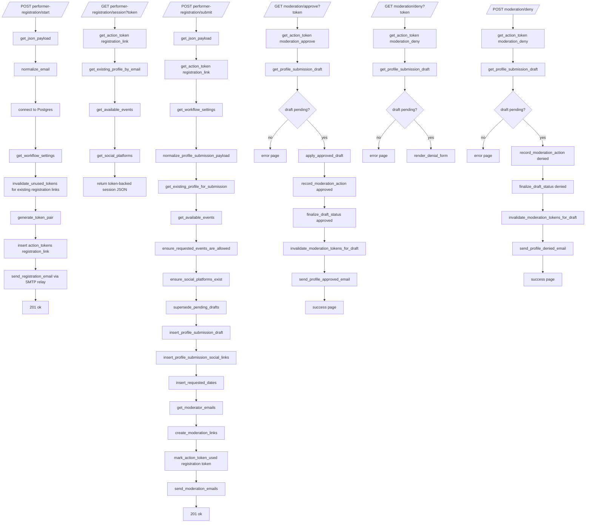
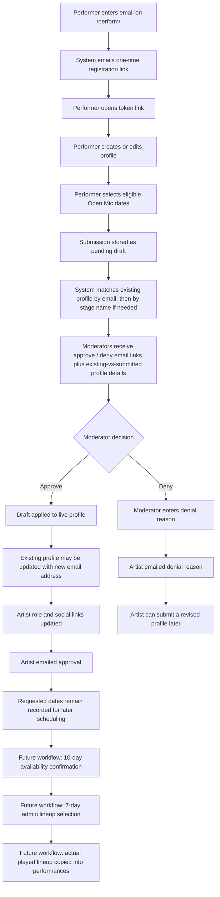
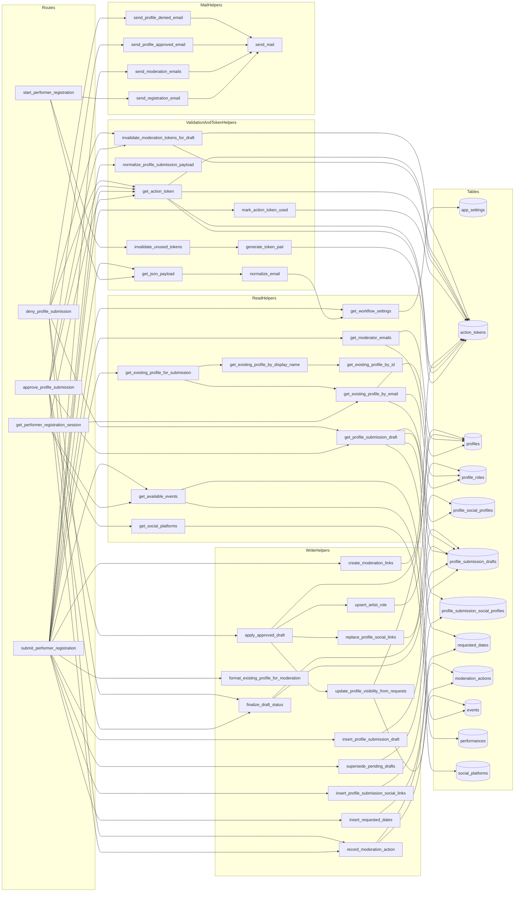
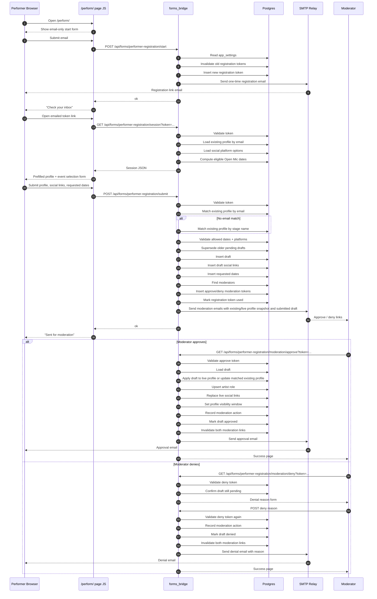

# Performer Workflow Flowchart

This file documents the current structure of `forms_bridge/performer_workflow.py` using Mermaid diagrams.

## End-To-End Flow

## Business Process Diagram

## Route / Helper / Data Interaction Map

## Sequence Diagram

## Notes

- `get_available_events` currently restricts dates to Open Mic events only with `type_id = 1`.
- Submission-time profile matching now works by:
  - email first
  - then exact case-insensitive `display_name` if email did not match
- That means a changed email address can currently update an existing profile when the stage name matches.
- Moderator emails now include both the existing live profile snapshot and the submitted draft details when a match is found.
- `apply_approved_draft` currently sets `profile_visible_from` using the earliest requested event date.
- That visibility rule is a temporary approximation until the later admin selection workflow is implemented.
- Email delivery now goes through SMTP relay using `FORMS_SMTP_HOST` and `FORMS_SMTP_PORT`.
