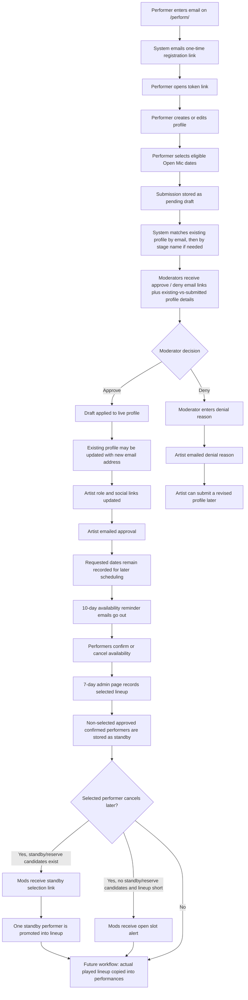

# Performer Workflow Flowchart

This file documents the current structure of `forms_bridge/performer_workflow.py` using Mermaid diagrams.

## End-To-End Flow

```mermaid
flowchart TD
    A[/POST performer-registration/start/] --> B[get_json_payload]
    B --> C[normalize_email]
    C --> D[connect to Postgres]
    D --> E[get_workflow_settings]
    E --> F[invalidate_unused_tokens for existing registration links]
    F --> G[generate_token_pair]
    G --> H[insert action_tokens registration_link]
    H --> I[send_registration_email via SMTP relay]
    I --> J[201 ok]

    K[/GET performer-registration/session?token/] --> L[get_action_token registration_link]
    L --> M[get_existing_profile_by_email]
    M --> N[get_available_events]
    N --> O[get_social_platforms]
    O --> P[return token-backed session JSON]

    Q[/POST performer-registration/submit/] --> R[get_json_payload]
    R --> S[get_action_token registration_link]
    S --> T[get_workflow_settings]
    T --> U[normalize_profile_submission_payload]
    U --> V[get_existing_profile_for_submission]
    V --> W[get_available_events]
    W --> X[ensure_requested_events_are_allowed]
    X --> Y[ensure_social_platforms_exist]
    Y --> Z[supersede_pending_drafts]
    Z --> AA[insert_profile_submission_draft]
    AA --> AB[insert_profile_submission_social_links]
    AB --> AC[insert_requested_dates]
    AC --> AD[get_moderator_emails]
    AD --> AE[create_moderation_links]
    AE --> AF[mark_action_token_used registration token]
    AF --> AG[send_moderation_emails]
    AG --> AH[201 ok]

    AI[/GET moderation/approve?token/] --> AJ[get_action_token moderation_approve]
    AJ --> AK[get_profile_submission_draft]
    AK --> AL{draft pending?}
    AL -- no --> AM[error page]
    AL -- yes --> AN[apply_approved_draft]
    AN --> AO[record_moderation_action approved]
    AO --> AP[finalize_draft_status approved]
    AP --> AQ[invalidate_moderation_tokens_for_draft]
    AQ --> AR[send_profile_approved_email]
    AR --> AS[success page]

    AT[/GET moderation/deny?token/] --> AU[get_action_token moderation_deny]
    AU --> AV[get_profile_submission_draft]
    AV --> AW{draft pending?}
    AW -- no --> AX[error page]
    AW -- yes --> AY[render_denial_form]

    AZ[/POST moderation/deny/] --> BA[get_action_token moderation_deny]
    BA --> BB[get_profile_submission_draft]
    BB --> BC{draft pending?}
    BC -- no --> BD[error page]
    BC -- yes --> BE[record_moderation_action denied]
    BE --> BF[finalize_draft_status denied]
    BF --> BG[invalidate_moderation_tokens_for_draft]
    BG --> BH[send_profile_denied_email]
    BH --> BI[success page]

    BJ[availability reminder job] --> BK[get_due_availability_requests]
    BK --> BL[create confirm/cancel action tokens]
    BL --> BM[send_availability_email]
    BM --> BN[get_unapproved_event_reminders]
    BN --> BO[send_unapproved_request_reminder_email]

    BP[/GET availability/confirm?token/] --> BQ[get_action_token availability_confirm]
    BQ --> BR[get_requested_date_with_context]
    BR --> BS[update_requested_date_availability_status confirmed]
    BS --> BT[invalidate_availability_tokens_for_requested_date]
    BT --> BU[success page]

    BV[/GET availability/cancel?token/] --> BW[get_action_token availability_cancel]
    BW --> BX[get_requested_date_with_context]
    BX --> BY[update_requested_date_availability_status cancelled]
    BY --> BZ[invalidate_availability_tokens_for_requested_date]
    BZ --> CA[handle_selection_cancellation_if_needed]
    CA --> CB{selected performer cancelled?}
    CB -- no --> CC[success page]
    CB -- yes, standby/reserve candidates exist --> CD[create backup_selection tokens]
    CD --> CE[send_backup_selection_email]
    CE --> CF[success page]
    CB -- yes, no standby/reserve candidates and lineup short --> CG[send_open_slot_alert_email]
    CG --> CH[success page]

    CI[admin selection job] --> CJ[get_due_admin_selection_events]
    CJ --> CK[create admin_selection tokens]
    CK --> CL[send_admin_selection_email]

    CM[/GET admin-selection?token/] --> CN[get_action_token admin_selection]
    CN --> CO[get_event_selection_context]
    CO --> CP[get_admin_selection_candidates]
    CP --> CQ[render_admin_selection_form]

    CR[/POST admin-selection/] --> CS[get_action_token admin_selection]
    CS --> CT[get_admin_selection_candidates]
    CT --> CU[save_admin_selection]
    CU --> CV[mark selected candidates as selected]
    CV --> CW[mark all other eligible candidates as standby]
    CW --> CX[send_selected_performer_emails]
    CX --> CY[success page]

    CZ[/GET backup-selection?token/] --> DA[get_action_token backup_selection]
    DA --> DB[get_event_selection_context]
    DB --> DC[get_current_selected_lineup]
    DC --> DD[get_backup_candidates]
    DD --> DE[render_backup_selection_form]

    DF[/POST backup-selection/] --> DG[get_action_token backup_selection]
    DG --> DH[promote_backup_selection]
    DH --> DI[invalidate_backup_selection_tokens_for_event]
    DI --> DJ[send_backup_promoted_email]
    DJ --> DK[success page]
```

## Business Process Diagram

## Route / Helper / Data Interaction Map

```mermaid
flowchart LR
    subgraph Routes
        R1[start_performer_registration]
        R2[get_performer_registration_session]
        R3[submit_performer_registration]
        R4[approve_profile_submission]
        R5[deny_profile_submission]
        R6[confirm_requested_date]
        R7[cancel_requested_date]
        R8[admin_selection]
        R9[backup_selection]
    end

    subgraph ValidationAndTokenHelpers
        H1[get_json_payload]
        H2[normalize_email]
        H3[normalize_profile_submission_payload]
        H4[get_action_token]
        H5[generate_token_pair]
        H6[invalidate_unused_tokens]
        H7[invalidate_moderation_tokens_for_draft]
        H8[mark_action_token_used]
        H9[invalidate_availability_tokens_for_requested_date]
        H10[invalidate_backup_selection_tokens_for_event]
    end

    subgraph ReadHelpers
        Q1[get_workflow_settings]
        Q2[get_existing_profile_by_email]
        Q3[get_existing_profile_by_display_name]
        Q4[get_existing_profile_by_id]
        Q5[get_existing_profile_for_submission]
        Q6[get_social_platforms]
        Q7[get_available_events]
        Q8[get_moderator_emails]
        Q9[get_profile_submission_draft]
        Q10[get_requested_date_with_context]
        Q11[get_due_availability_requests]
        Q12[get_unapproved_event_reminders]
        Q13[get_due_admin_selection_events]
        Q14[get_admin_emails]
        Q15[get_event_selection_context]
        Q16[get_admin_selection_candidates]
        Q17[get_current_selected_lineup]
        Q18[get_backup_candidates]
    end

    subgraph WriteHelpers
        W1[supersede_pending_drafts]
        W2[insert_profile_submission_draft]
        W3[insert_profile_submission_social_links]
        W4[insert_requested_dates]
        W5[create_moderation_links]
        W6[apply_approved_draft]
        W7[upsert_artist_role]
        W8[replace_profile_social_links]
        W9[update_profile_visibility_from_requests]
        W10[record_moderation_action]
        W11[finalize_draft_status]
        W12[format_existing_profile_for_moderation]
        W13[attach_profile_to_draft]
        W14[update_requested_date_availability_status]
        W15[handle_selection_cancellation_if_needed]
        W16[save_admin_selection]
        W17[promote_backup_selection]
    end

    subgraph MailHelpers
        M1[send_registration_email]
        M2[send_moderation_emails]
        M3[send_profile_approved_email]
        M4[send_profile_denied_email]
        M5[send_mail]
        M6[send_availability_email]
        M7[send_unapproved_request_reminder_email]
        M8[send_admin_selection_email]
        M9[send_selected_performer_emails]
        M10[send_backup_selection_email]
        M11[send_backup_promoted_email]
        M12[send_open_slot_alert_email]
    end

    subgraph Tables
        T1[(app_settings)]
        T2[(action_tokens)]
        T3[(profiles)]
        T4[(profile_roles)]
        T5[(profile_social_profiles)]
        T6[(profile_submission_drafts)]
        T7[(profile_submission_social_profiles)]
        T8[(requested_dates)]
        T9[(moderation_actions)]
        T10[(events)]
        T11[(performances)]
        T12[(social_platforms)]
        T13[(event_performer_selections)]
    end

    R1 --> H1 --> H2 --> Q1
    R1 --> H6 --> H5 --> T2
    R1 --> M1 --> M5

    R2 --> H4 --> T2
    R2 --> Q2 --> T3
    Q2 --> T4
    Q2 --> T5
    R2 --> Q7 --> T10
    Q7 --> T11
    R2 --> Q6 --> T12

    R3 --> H1
    R3 --> H4 --> T2
    R3 --> Q1 --> T1
    R3 --> H3
    R3 --> Q5
    Q5 --> Q2
    Q5 --> Q3
    Q3 --> Q4
    R3 --> Q7
    R3 --> W1 --> T6
    R3 --> W2 --> T6
    R3 --> W3 --> T7
    R3 --> W4 --> T8
    R3 --> Q8 --> T3
    Q8 --> T4
    R3 --> W5 --> T2
    R3 --> W12
    R3 --> H8 --> T2
    R3 --> M2 --> M5

    R4 --> H4 --> T2
    R4 --> Q9 --> T6
    Q9 --> T7
    Q9 --> T8
    R4 --> W6 --> T3
    W6 --> W7 --> T4
    W6 --> W8 --> T5
    W6 --> W9 --> T3
    W9 --> T10
    R4 --> W10 --> T9
    R4 --> W11 --> T6
    R4 --> W13 --> T6
    R4 --> H7 --> T2
    R4 --> M3 --> M5

    R5 --> H4 --> T2
    R5 --> Q9 --> T6
    R5 --> W10 --> T9
    R5 --> W11 --> T6
    R5 --> H7 --> T2
    R5 --> M4 --> M5

    R6 --> H4 --> T2
    R6 --> Q10 --> T8
    Q10 --> T6
    Q10 --> T10
    R6 --> W14 --> T8
    R6 --> H9 --> T2

    R7 --> H4 --> T2
    R7 --> Q10 --> T8
    R7 --> W14 --> T8
    R7 --> H9 --> T2
    R7 --> W15
    W15 --> Q8
    W15 --> Q15
    W15 --> Q18
    W15 --> M10
    W15 --> M12

    R8 --> H4 --> T2
    R8 --> Q15 --> T10
    R8 --> Q16 --> T8
    Q16 --> T6
    Q16 --> T3
    Q16 --> T13
    R8 --> W16 --> T13
    W16 --> T8
    R8 --> M9 --> M5

    R9 --> H4 --> T2
    R9 --> Q15 --> T10
    R9 --> Q17 --> T13
    Q17 --> T3
    R9 --> Q18 --> T13
    R9 --> W17 --> T13
    W17 --> T8
    R9 --> H10 --> T2
    R9 --> M11 --> M5
```

## Sequence Diagram

```mermaid
sequenceDiagram
    autonumber
    participant Performer as Performer Browser
    participant Site as /perform/ page JS
    participant Bridge as forms_bridge
    participant DB as Postgres
    participant SMTP as SMTP Relay
    participant Mod as Moderator
    participant Admin as Admin

    Performer->>Site: Open /perform/
    Site-->>Performer: Show email-only start form

    Performer->>Site: Submit email
    Site->>Bridge: POST /api/forms/performer-registration/start
    Bridge->>DB: Read app_settings
    Bridge->>DB: Invalidate old registration tokens
    Bridge->>DB: Insert new registration token
    Bridge->>SMTP: Send one-time registration email
    SMTP-->>Performer: Registration link email
    Bridge-->>Site: ok
    Site-->>Performer: “Check your inbox”

    Performer->>Site: Open emailed token link
    Site->>Bridge: GET /api/forms/performer-registration/session?token=...
    Bridge->>DB: Validate token
    Bridge->>DB: Load existing profile by email
    Bridge->>DB: Load social platform options
    Bridge->>DB: Compute eligible Open Mic dates
    Bridge-->>Site: Session JSON
    Site-->>Performer: Prefilled profile + event selection form

    Performer->>Site: Submit profile, social links, requested dates
    Site->>Bridge: POST /api/forms/performer-registration/submit
    Bridge->>DB: Validate token
    Bridge->>DB: Match existing profile by email
    alt No email match
        Bridge->>DB: Match existing profile by stage name
    end
    Bridge->>DB: Validate allowed dates + platforms
    Bridge->>DB: Supersede older pending drafts
    Bridge->>DB: Insert draft
    Bridge->>DB: Insert draft social links
    Bridge->>DB: Insert requested dates
    Bridge->>DB: Find moderators
    Bridge->>DB: Insert approve/deny moderation tokens
    Bridge->>DB: Mark registration token used
    Bridge->>SMTP: Send moderation emails with existing/live profile snapshot and submitted draft
    SMTP-->>Mod: Approve / deny links
    Bridge-->>Site: ok
    Site-->>Performer: “Sent for moderation”

    alt Moderator approves
        Mod->>Bridge: GET /api/forms/performer-registration/moderation/approve?token=...
        Bridge->>DB: Validate approve token
        Bridge->>DB: Load draft
        Bridge->>DB: Apply draft to live profile or update matched existing profile
        Bridge->>DB: Upsert artist role
        Bridge->>DB: Replace live social links
        Bridge->>DB: Set profile visibility window
        Bridge->>DB: Record moderation action
        Bridge->>DB: Mark draft approved
        Bridge->>DB: Invalidate both moderation links
        Bridge->>SMTP: Send approval email
        SMTP-->>Performer: Approval email
        Bridge-->>Mod: Success page
    else Moderator denies
        Mod->>Bridge: GET /api/forms/performer-registration/moderation/deny?token=...
        Bridge->>DB: Validate deny token
        Bridge->>DB: Confirm draft still pending
        Bridge-->>Mod: Denial reason form
        Mod->>Bridge: POST deny reason
        Bridge->>DB: Validate deny token again
        Bridge->>DB: Record moderation action
        Bridge->>DB: Mark draft denied
        Bridge->>DB: Invalidate both moderation links
        Bridge->>SMTP: Send denial email with reason
        SMTP-->>Performer: Denial email
        Bridge-->>Mod: Success page
    end

    Bridge->>DB: Reminder job finds events at availability_confirmation_lead_days
    Bridge->>DB: Create confirm/cancel tokens for requested dates
    Bridge->>SMTP: Send availability reminder emails
    SMTP-->>Performer: Confirm / cancel links

    alt Performer confirms availability
        Performer->>Bridge: GET /availability/confirm?token=...
        Bridge->>DB: Validate confirm token
        Bridge->>DB: Mark requested_dates availability_confirmed
        Bridge->>DB: Invalidate both availability links
        Bridge-->>Performer: Success page
    else Performer cancels availability
        Performer->>Bridge: GET /availability/cancel?token=...
        Bridge->>DB: Validate cancel token
        Bridge->>DB: Mark requested_dates availability_cancelled
        Bridge->>DB: Invalidate both availability links
        Bridge->>DB: If selected lineup exists, mark selection cancelled
        alt Standby/reserve candidates exist
            Bridge->>DB: Create backup_selection tokens
            Bridge->>SMTP: Email moderators standby-selection links
            SMTP-->>Mod: Standby selection link
        else No standby/reserve candidates and lineup short
            Bridge->>SMTP: Email moderators open-slot alert
            SMTP-->>Mod: Open slot alert
        end
        Bridge-->>Performer: Success page
    end

    Bridge->>DB: Admin-selection job finds events at final_selection_lead_days
    Bridge->>DB: Create admin_selection tokens
    Bridge->>SMTP: Email admins lineup-selection links
    SMTP-->>Admin: Admin selection link

    Admin->>Bridge: GET /admin-selection?token=...
    Bridge->>DB: Validate admin token
    Bridge->>DB: Load eligible approved confirmed candidates
    Bridge-->>Admin: Tokenized lineup selection page

    Admin->>Bridge: POST selected lineup
    Bridge->>DB: Save selected candidates as selected
    Bridge->>DB: Save all remaining eligible candidates as standby
    Bridge->>SMTP: Email selected performers
    SMTP-->>Performer: Performance confirmed email
    Bridge-->>Admin: Success page

    alt Moderator promotes standby later
        Mod->>Bridge: GET /backup-selection?token=...
        Bridge->>DB: Validate standby selection token
        Bridge->>DB: Load current lineup and standby/reserve pool
        Bridge-->>Mod: Standby promotion page
        Mod->>Bridge: POST chosen standby performer
        Bridge->>DB: Promote standby performer to selected
        Bridge->>DB: Invalidate backup-selection tokens for event
        Bridge->>SMTP: Email promoted standby performer
        SMTP-->>Performer: Promoted from standby email
        Bridge-->>Mod: Success page
    end
```

## Notes

- `get_available_events` currently restricts dates to Open Mic events only with `type_id = 1`.
- Submission-time profile matching now works by:
  - email first
  - then exact case-insensitive `display_name` if email did not match
- That means a changed email address can currently update an existing profile when the stage name matches.
- Moderator emails now include both the existing live profile snapshot and the submitted draft details when a match is found.
- `apply_approved_draft` currently sets `profile_visible_from` using the earliest requested event date.
- That visibility rule is still a temporary approximation; the ideal final behavior is to key visibility from a first actually selected/performed event.
- The 7-day admin selection flow now stores:
  - selected performers as `selected`
  - all other eligible approved confirmed performers as `standby`
- If a selected performer cancels and standby/reserve candidates exist, moderators receive a tokenized backup-selection page.
- If a selected performer cancels and no standby/reserve candidates exist while the lineup is now short, moderators receive an open-slot alert email.
- Email delivery now goes through SMTP relay using `FORMS_SMTP_HOST` and `FORMS_SMTP_PORT`.
