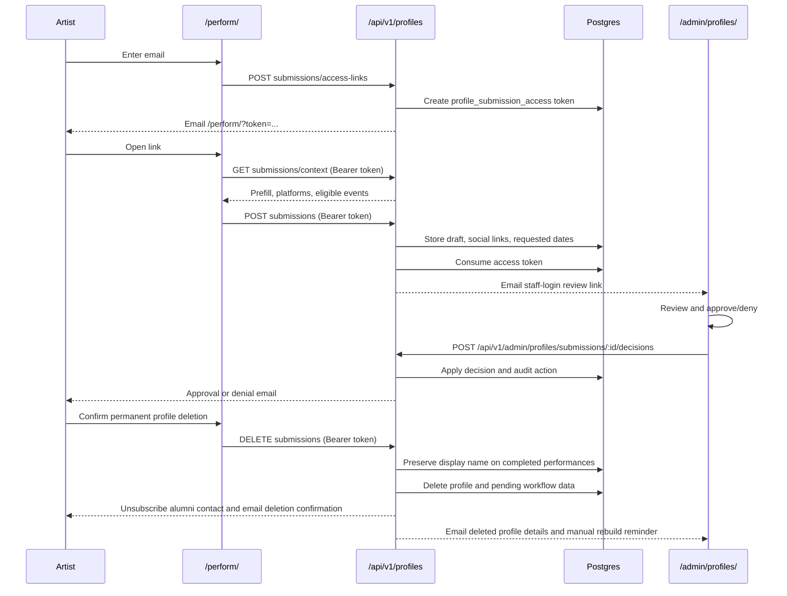
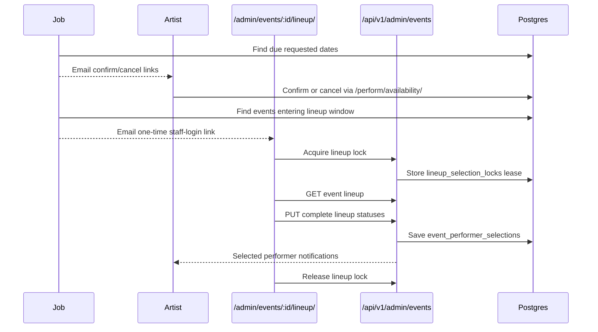
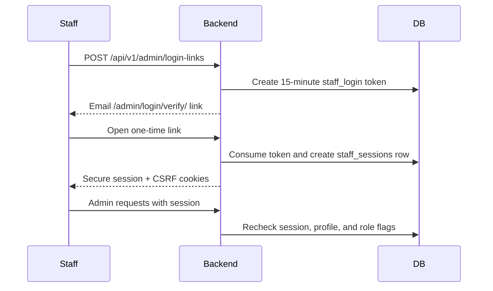

# Performer and Lineup Workflow

This document describes the current backend workflow after the API v1 and
staff-area rework.

## Profile Submission


```mermaid
sequenceDiagram
    participant Artist
    participant Site as /perform/
    participant API as /api/v1/profiles
    participant DB as Postgres
    participant Staff as /admin/profiles/

    Artist->>Site: Enter email
    Site->>API: POST submissions/access-links
    API->>DB: Create profile_submission_access token
    API-->>Artist: Email /perform/?token=...
    Artist->>Site: Open link
    Site->>API: GET submissions/context (Bearer token)
    API-->>Site: Prefill, platforms, eligible events
    Site->>API: POST submissions (Bearer token)
    API->>DB: Store draft, social links, requested dates
    API->>DB: Consume access token
    API-->>Staff: Email staff-login review link
    Staff->>Staff: Review and approve/deny
    Staff->>API: POST /api/v1/admin/profiles/submissions/:id/decisions
    API->>DB: Apply decision and audit action
    API-->>Artist: Approval or denial email

    Artist->>Site: Confirm permanent profile deletion
    Site->>API: DELETE submissions (Bearer token)
    API->>DB: Preserve display name on completed performances
    API->>DB: Delete profile and pending workflow data
    API-->>Artist: Unsubscribe alumni contact and email deletion confirmation
    API-->>Staff: Email deleted profile details and manual rebuild reminder
```

## Availability and Lineup Selection


```mermaid
sequenceDiagram
    participant Job
    participant Artist
    participant Admin as /admin/events/:id/lineup/
    participant API as /api/v1/admin/events
    participant DB as Postgres

    Job->>DB: Find due requested dates
    Job-->>Artist: Email confirm/cancel links
    Artist->>DB: Confirm or cancel via /perform/availability/
    Job->>DB: Find events entering lineup window
    Job-->>Admin: Email one-time staff-login link
    Admin->>API: Acquire lineup lock
    API->>DB: Store lineup_selection_locks lease
    Admin->>API: GET event lineup
    Admin->>API: PUT complete lineup statuses
    API->>DB: Save event_performer_selections
    API-->>Artist: Selected performer notifications
    Admin->>API: Release lineup lock
```

`event_performer_selections` is the planned lineup source of truth.
`performances` records who actually played.

If a selected performer cancels, moderators receive a staff-login link to
`/admin/events/<event_id>/standby/`. A promotion is recorded through
`POST /api/v1/admin/events/<event_id>/lineup/promotions`.

## Staff Authentication


```mermaid
sequenceDiagram
    participant Staff
    participant Backend
    participant DB

    Staff->>Backend: POST /api/v1/admin/login-links
    Backend->>DB: Create 15-minute staff_login token
    Backend-->>Staff: Email /admin/login/verify/ link
    Staff->>Backend: Open one-time link
    Backend->>DB: Consume token and create staff_sessions row
    Backend-->>Staff: Secure session + CSRF cookies
    Staff->>Backend: Admin requests with session
    Backend->>DB: Recheck session, profile, and role flags
```

Administrators have full staff access. Moderators can review profile
submissions and promote standby performers.

## Jobs

```bash
python -m backend.jobs.send_availability_reminders
python -m backend.jobs.send_lineup_selection_links
python -m backend.jobs.send_moderation_reminders
```
