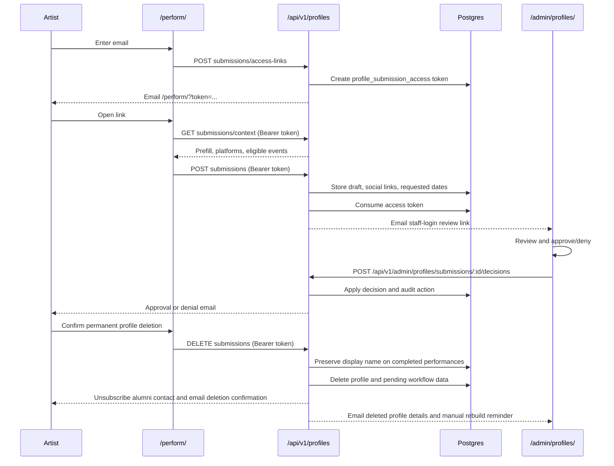
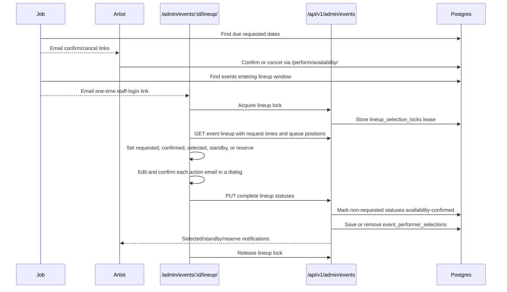
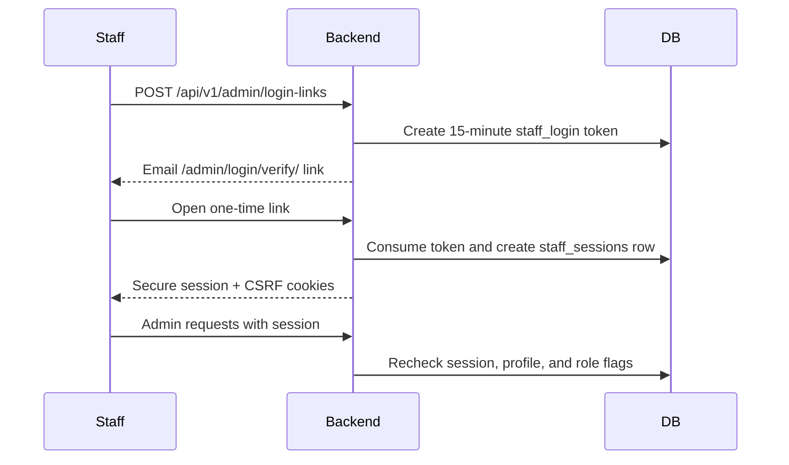

# Performer and Lineup Workflow

This document describes the current backend workflow after the API v1 and
staff-area rework.

## Profile Submission


```mermaid
sequenceDiagram
    participant Artist
    participant Site as /perform/
    participant API as /api/v1/profiles
    participant DB as Postgres
    participant Staff as /admin/profiles/

    Artist->>Site: Enter email
    Site->>API: POST submissions/access-links
    API->>DB: Create profile_submission_access token
    API-->>Artist: Email /perform/?token=...
    Artist->>Site: Open link
    Site->>API: GET submissions/context (Bearer token)
    API-->>Site: Prefill, platforms, eligible events
    Site->>API: POST submissions (Bearer token)
    API->>DB: Store draft, social links, requested dates
    API->>DB: Consume access token
    API-->>Staff: Email staff-login review link
    Staff->>Staff: Review and approve/deny
    Staff->>API: POST /api/v1/admin/profiles/submissions/:id/decisions
    API->>DB: Apply decision and audit action
    API-->>Artist: Approval or denial email

    Artist->>Site: Confirm permanent profile deletion
    Site->>API: DELETE submissions (Bearer token)
    API->>DB: Preserve display name on completed performances
    API->>DB: Delete profile and pending workflow data
    API-->>Artist: Unsubscribe alumni contact and email deletion confirmation
    API-->>Staff: Email deleted profile details and manual rebuild reminder
```

## Availability and Lineup Selection


```mermaid
sequenceDiagram
    participant Job
    participant Artist
    participant Admin as /admin/events/:id/lineup/
    participant API as /api/v1/admin/events
    participant DB as Postgres

    Job->>DB: Find due requested dates
    Job-->>Artist: Email confirm/cancel links
    Artist->>DB: Confirm or cancel via /perform/availability/
    Job->>DB: Find events entering lineup window
    Job-->>Admin: Email one-time staff-login link
    Admin->>API: Acquire lineup lock
    API->>DB: Store lineup_selection_locks lease
    Admin->>API: GET event lineup with request times and queue positions
    Admin->>Admin: Set requested, confirmed, selected, standby, or reserve
    Admin->>Admin: Edit and confirm each action email in a dialog
    Admin->>API: PUT complete lineup statuses
    API->>DB: Mark non-requested statuses availability-confirmed
    API->>DB: Save or remove event_performer_selections
    API-->>Artist: Selected/standby/reserve notifications
    Admin->>API: Release lineup lock
```

`event_performer_selections` is the planned lineup source of truth.
`performances` records who actually played.

The admin lineup page presents a unified status for each request. `requested`
means that no lineup-selection row exists; `availability_confirmed` means the
performer is confirmed but not assigned to the lineup; `selected`, `standby`,
and `reserve` are stored in `event_performer_selections`. Selecting any of the
last three statuses also records `requested_dates.status` as
`availability_confirmed`, allowing an administrator's direct conversation with
the performer to override the emailed availability check.

The Action column sends the email associated with the staged status only after
the administrator reviews or edits the message. A requested row sends or
resends the availability confirmation, selected sends the performance
confirmation, standby includes the oldest-first request queue number, and
reserve explains the recent-performance cooldown. Availability-confirmed has
no action. Default messages begin with `Hi <first name>`, falling back to the
display name.

If a selected performer cancels, moderators receive a staff-login link to
`/admin/events/<event_id>/standby/`. A promotion is recorded through
`POST /api/v1/admin/events/<event_id>/lineup/promotions`.

## Staff Authentication


```mermaid
sequenceDiagram
    participant Staff
    participant Backend
    participant DB

    Staff->>Backend: POST /api/v1/admin/login-links
    Backend->>DB: Create 15-minute staff_login token
    Backend-->>Staff: Email /admin/login/verify/ link
    Staff->>Backend: Open one-time link
    Backend->>DB: Consume token and create staff_sessions row
    Backend-->>Staff: Secure session + CSRF cookies
    Staff->>Backend: Admin requests with session
    Backend->>DB: Recheck session, profile, and role flags
```

Administrators have full staff access. Moderators can review profile
submissions and promote standby performers. Profile moderation displays
submitted social links and previous performance titles; approval/denial
messages are editable, and administrators can withdraw individual requested
dates before approving a submission.

## Jobs

```bash
python -m backend.jobs.send_availability_reminders
python -m backend.jobs.send_lineup_selection_links
python -m backend.jobs.send_moderation_reminders
```
