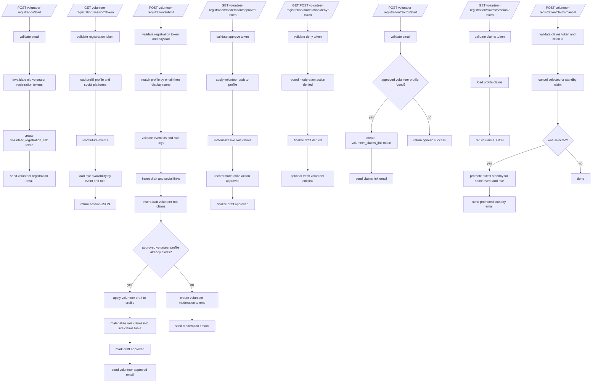

# Volunteer Workflow Flowchart

This file documents `forms_bridge/volunteer_workflow.py` and the volunteer role-claim lifecycle.

## End-To-End Flow

## Data Notes

- Effective role capacity uses:
  - `event_volunteer_role_overrides.capacity_override` when present
  - otherwise `volunteer_roles.default_capacity`
- New claims become:
  - `selected` while selected count is below capacity
  - `standby` once capacity is full
- Cancellation sets claim status to `cancelled`.
- Selected cancellation auto-promotes the oldest standby claim for the same event and role.
