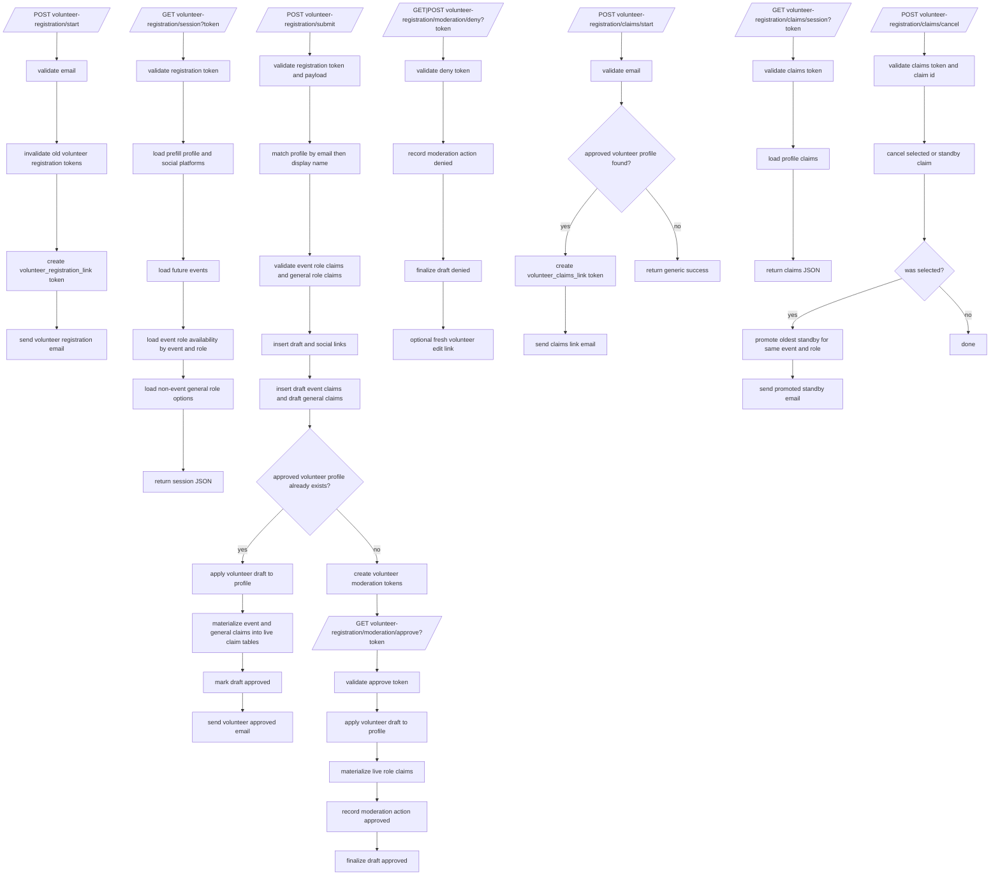

# Volunteer Workflow Flowchart

This file documents `forms_bridge/volunteer_workflow.py` and the volunteer role-claim lifecycle.

## End-To-End Flow

## Data Notes

- Effective event role capacity uses:
  - `event_volunteer_role_overrides.capacity_override` when present
  - otherwise `volunteer_roles.default_capacity`
- New event-role claims become:
  - `selected` while selected count is below capacity
  - `standby` once capacity is full
- Non-event general roles are stored as active/withdrawn claims independent of event dates.
- Cancellation sets event-role claim status to `cancelled`.
- Selected event-role cancellation auto-promotes the oldest standby claim for the same event and role.
